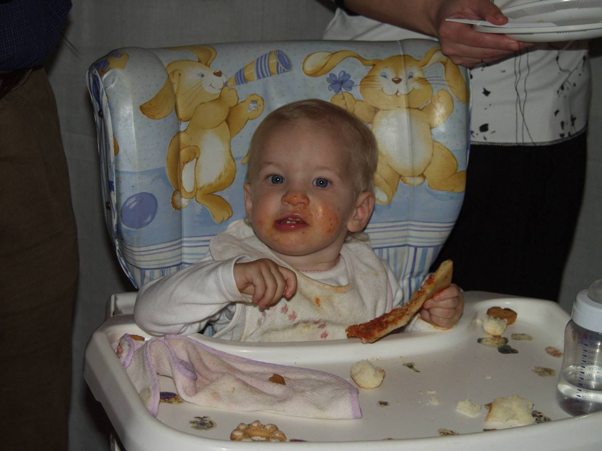

Вот шаблон **одинакового компонента секции** для всех трёх блоков. Его можно переиспользовать, меняя только модификатор, тексты, картинку/контент и id. В текущем HTML секции уже похожи: `hero`, `next-part`, `next-part--story`, а стили для общих секций лежат в `styles.css`.

```html
<section class="section-block section-block--variant" id="sectionId">
  <div class="section-block__scene">
    <p class="section-block__text section-block__text--top-left">
      Текст сверху слева
    </p>

    <div class="section-block__content">
      <!-- сюда вставляется фото, модель, слайдер или любой другой контент -->
      <figure class="postcard-photo">
        
      </figure>
    </div>

    <p class="section-block__text section-block__text--bottom-right">
      Текст снизу справа
    </p>

    <button
      type="button"
      class="scroll-down-btn scroll-down-btn--always-visible"
      aria-label="Прокрутить к следующей секции"
      data-scroll-target="#nextSectionId"
    >
      ↓
    </button>
  </div>
</section>
```

CSS-шаблон:

```css
.section-block {
  min-height: 100vh;
  min-height: 100svh;
  min-height: 100dvh;
  width: 100%;
  display: flex;
  align-items: center;
  justify-content: center;
  padding: 2.4rem var(--page-side-padding);
  position: relative;
  box-sizing: border-box;
}

.section-block__scene {
  width: 100%;
  max-width: var(--page-max-width);
  min-height: min(84svh, 760px);
  min-width: 0;
  position: relative;
  display: grid;
  place-items: center;
}

.section-block__content {
  display: grid;
  place-items: center;
}

.section-block__text {
  margin: 0;
  position: absolute;
  color: var(--decor-color);
  font-family: var(--decor-font);
  font-size: clamp(1.85rem, 5vw, 4.2rem);
  line-height: 1.08;
  text-shadow: var(--decor-shadow);
  max-width: min(46vw, 440px);
}

.section-block__text--top-left {
  top: clamp(1.8rem, 5.5vh, 3.4rem);
  left: clamp(0.8rem, 3vw, 2rem);
  text-align: left;
  max-width: min(44vw, 520px);
}

.section-block__text--top-right {
  top: clamp(1.8rem, 5.5vh, 3.4rem);
  right: clamp(0.8rem, 3vw, 2rem);
  text-align: right;
}

.section-block__text--bottom-right {
  right: clamp(0.8rem, 3vw, 2rem);
  bottom: clamp(1.8rem, 5.5vh, 3.4rem);
  text-align: right;
}

.section-block__text--bottom-left {
  left: clamp(0.8rem, 3vw, 2rem);
  bottom: clamp(1.8rem, 5.5vh, 3.4rem);
  text-align: left;
}

@media (max-width: 920px) {
  .section-block__scene {
    min-height: min(88svh, 760px);
  }

  .section-block__text {
    max-width: min(72vw, 440px);
    font-size: clamp(1.75rem, 7.8vw, 3.3rem);
  }
}
```

JS для одинаковой прокрутки между секциями:

```js
function setupSectionScrollButtons() {
  const buttons = document.querySelectorAll('[data-scroll-target]');

  buttons.forEach((button) => {
    const targetSelector = button.dataset.scrollTarget;
    const target = document.querySelector(targetSelector);

    if (!target) return;

    button.addEventListener('click', () => {
      target.scrollIntoView({
        behavior: 'smooth',
        block: 'start',
      });
    });
  });
}
```

Пример трёх одинаковых блоков:

```html
<section class="section-block" id="sectionOne">
  <div class="section-block__scene">
    <p class="section-block__text section-block__text--top-left">
      26 апреля в Италии...
    </p>

    <div class="section-block__content">
      <!-- 3D-модель или фото -->
    </div>

    <p class="section-block__text section-block__text--bottom-right">
      И назвали её Полина.
    </p>

    <button
      type="button"
      class="scroll-down-btn scroll-down-btn--always-visible"
      data-scroll-target="#sectionTwo"
      aria-label="Прокрутить вниз"
    >
      ↓
    </button>
  </div>
</section>

<section class="section-block" id="sectionTwo">
  <div class="section-block__scene">
    <p class="section-block__text section-block__text--top-left">
      Сначала все подумали:
    </p>

    <div class="section-block__content">
      <figure class="postcard-photo">
        
      </figure>
    </div>

    <p class="section-block__text section-block__text--bottom-right">
      «Какая милая девочка!»
    </p>

    <button
      type="button"
      class="scroll-down-btn scroll-down-btn--always-visible"
      data-scroll-target="#sectionThree"
      aria-label="Прокрутить вниз"
    >
      ↓
    </button>
  </div>
</section>

<section class="section-block" id="sectionThree">
  <div class="section-block__scene">
    <p class="section-block__text section-block__text--top-left">
      Но никто тогда ещё не знал...
    </p>

    <div class="section-block__content">
      <!-- слайдер -->
    </div>

    <p class="section-block__text section-block__text--bottom-right">
      Подпись или финальный текст
    </p>
  </div>
</section>
```

Главная идея: **все секции имеют один каркас**:

```html
<section>
  <div class="scene">
    <p class="text top"></p>
    <div class="content"></div>
    <p class="text bottom"></p>
    <button></button>
  </div>
</section>
```
